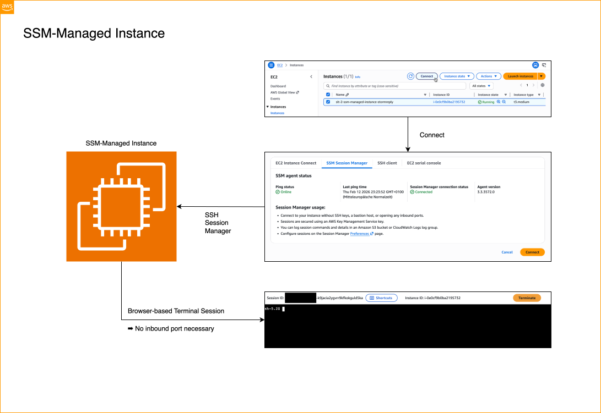

### Storm Library for Terraform
# SSM-Managed Instance

An EC2 instance with _AmazonSSMManagedInstanceCore_ policy included in
its profile, allowing to connect to the instance securely via AWS SSM's
Session Manager.

This repository is a member of the SLT | Storm Library for Terraform,
a collection of Terraform modules for Amazon Web Services. The focus
of these modules, maintained in separate GitHub™ repositories, is on
building examples, demos and showcases on AWS. The audience of the
library is learners and presenters alike - people that want to know
or show how a certain service, pattern or solution looks like, or "feels".

[Learn more](https://github.com/stormreply/storm-library-for-terraform)

## Installation

This demo can be built using GitHub Actions. In order to do so

- [Install the Storm Library for Terraform](https://github.com/stormreply/storm-library-for-terraform/blob/main/docs/INSTALL-LIBRARY.md)
- [Deploy this member repository](https://github.com/stormreply/storm-library-for-terraform/blob/main/docs/DEPLOY-MEMBER.md)

Deployment of this member should take < 2 minutes on GitHub resources.

## Architecture

## Explore this demo

This is rather a helper module than a demo. It provides for an EC2
instance with the _AmazonSSMManagedInstanceCore_ AWS managed policy
attached to its profile in order to
[login into your EC2 instance using AWS Session Manager](https://docs.aws.amazon.com/AWSEC2/latest/UserGuide/connect-with-systems-manager-session-manager.html).

The instance itself has no dedicated purpose. In the context of the
[Storm Library for Terraform](https://github.com/stormreply/storm-library-for-terraform)
it often serves as controller host, supporting the deployment flow where
Terraform can't, or as an instance for interacting with and exploring of
resources of a demo.

<h2>Terraform Docs</h2>

<!-- BEGIN_TF_DOCS -->
## Requirements

| Name | Version |
|------|---------|
|  [terraform](#requirement\_terraform) | >= 1 |
|  [aws](#requirement\_aws) | >= 6 |

## Providers

| Name | Version |
|------|---------|
|  [aws](#provider\_aws) | >= 6 |

## Modules

No modules.

## Resources

| Name | Type |
|------|------|
| [aws\_iam\_instance\_profile.instance](https://registry.terraform.io/providers/hashicorp/aws/latest/docs/resources/iam_instance_profile) | resource |
| [aws\_iam\_role.instance](https://registry.terraform.io/providers/hashicorp/aws/latest/docs/resources/iam_role) | resource |
| [aws\_iam\_role\_policy\_attachment.additional\_policies](https://registry.terraform.io/providers/hashicorp/aws/latest/docs/resources/iam_role_policy_attachment) | resource |
| [aws\_iam\_role\_policy\_attachment.administrator\_access](https://registry.terraform.io/providers/hashicorp/aws/latest/docs/resources/iam_role_policy_attachment) | resource |
| [aws\_iam\_role\_policy\_attachment.amazon\_ssm\_managed\_instance\_core](https://registry.terraform.io/providers/hashicorp/aws/latest/docs/resources/iam_role_policy_attachment) | resource |
| [aws\_instance.instance](https://registry.terraform.io/providers/hashicorp/aws/latest/docs/resources/instance) | resource |
| [aws\_ami.latest\_amazon\_linux\_ami](https://registry.terraform.io/providers/hashicorp/aws/latest/docs/data-sources/ami) | data source |
| [aws\_iam\_policy.administrator\_access](https://registry.terraform.io/providers/hashicorp/aws/latest/docs/data-sources/iam_policy) | data source |
| [aws\_iam\_policy.amazon\_ssm\_managed\_instance\_core](https://registry.terraform.io/providers/hashicorp/aws/latest/docs/data-sources/iam_policy) | data source |
| [aws\_iam\_policy\_document.client\_assume\_role](https://registry.terraform.io/providers/hashicorp/aws/latest/docs/data-sources/iam_policy_document) | data source |
| [aws\_region.current](https://registry.terraform.io/providers/hashicorp/aws/latest/docs/data-sources/region) | data source |

## Inputs

| Name | Description | Type | Default | Required |
|------|-------------|------|---------|:--------:|
|  [\_metadata](#input\_\_metadata) | Select metadata passed from GitHub Workflows | <pre>object({     actor      = string # Github actor (deployer) of the deployment     catalog_id = string # SLT catalog id of this module     deployment = string # slt-<catalod_id>-<repo>-<actor>     ref        = string # Git reference of the deployment     ref_name   = string # Git ref_name (branch) of the deployment     repo       = string # GitHub short repository name (without owner) of the deployment     repository = string # GitHub full repository name (including owner) of the deployment     sha        = string # Git (full-length, 40 char) commit SHA of the deployment     short_name = string # slt-<catalog_id>-<actor>     time       = string # Timestamp of the deployment   })</pre> | <pre>{   "actor": "",   "catalog_id": "",   "deployment": "",   "ref": "",   "ref_name": "",   "repo": "",   "repository": "",   "sha": "",   "short_name": "",   "time": "" }</pre> | no |
|  [ami](#input\_ami) | AMI (Id) to use for the instance | `string` | `null` | no |
|  [dependencies](#input\_dependencies) | A list of dependencies to objects of any type. This variable is a workaround for \_depends\_on\_, which won't work because the module defines its own provider. | `list(any)` | `[]` | no |
|  [detailed\_monitoring](#input\_detailed\_monitoring) | Flag for detailed monitoring. Make sure to understand cost/benefit relationship. Check: https://docs.aws.amazon.com/AWSEC2/latest/UserGuide/manage-detailed-monitoring.html | `bool` | `true` | no |
|  [instance\_type](#input\_instance\_type) | Instance type | `string` | `"t3.medium"` | no |
|  [key\_name](#input\_key\_name) | Key pair name to use | `string` | `null` | no |
|  [name](#input\_name) | Instance name | `string` | `null` | no |
|  [policies](#input\_policies) | List of IAM policy ARNs to attach to the instance | `list(string)` | `[]` | no |
|  [region](#input\_region) | Region where to deploy to | `string` | `null` | no |
|  [root\_volume\_size](#input\_root\_volume\_size) | Root volume size in GB | `number` | `50` | no |
|  [source\_dest\_check](#input\_source\_dest\_check) | Disable source/dest check (default true) | `bool` | `true` | no |
|  [subnet\_id](#input\_subnet\_id) | Id of the subnet to create this instance in | `string` | `null` | no |
|  [user\_data](#input\_user\_data) | User data to pass to the instance | `string` | `null` | no |
|  [user\_data\_base64](#input\_user\_data\_base64) | User data to pass to the instance; base64-encoded | `string` | `null` | no |
|  [vpc\_security\_group\_ids](#input\_vpc\_security\_group\_ids) | List of security group IDs to use with the instance | `list(string)` | `null` | no |

## Outputs

| Name | Description |
|------|-------------|
|  [\_slt\_config](#output\_\_slt\_config) | Map of SLT configuration |
|  [dependencies](#output\_dependencies) | The list of (pseudo) dependencies being passed to the module. |
|  [instance](#output\_instance) | The SSM-managed instance being created. |
<!-- END_TF_DOCS -->

